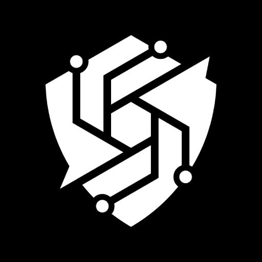

<p align="center">
  <a href="https://hackerai.co/">
    
  </a>
</p>

<h1 align="center">HackerAI</h1>

<h2 align="center">Your AI-Powered Penetration Testing Assistant</h2>

<div align="center">

[](LICENSE)
[](https://hackerai.co)

</div>

---

## 🚀 Local / Personal Setup (Recommended)

This is a **fully local setup** — no WorkOS, no E2B cloud sandbox, no Trigger.dev required. Everything runs on your machine.

### Prerequisites

- **Node.js** 20, 22, or 24 (check with `node -v`)
- **pnpm** 10+ (`npm install -g pnpm` or via [corepack](https://nodejs.org/api/corepack.html))
- **Docker** (for the Centrifugo real-time relay and local sandbox)
- **Git**

### 1. Clone the repository

```bash
git clone https://github.com/inventashif/hackerai.git
cd hackerai
```

### 2. Install dependencies

```bash
pnpm install
```

### 3. Run the personal setup script

This generates a JWT keypair, auto-fills all local secrets, and writes `.env.local`:

```bash
pnpm personal:setup
```

### 4. Add your OpenCode Zen API key

Get a **free** key at [https://opencode.ai/zen](https://opencode.ai/zen) (sign in → copy an API key).

Open `.env.local` and paste it:

```env
OPENCODE_ZEN_API_KEY=sk-your-key-here
```

Free models like `deepseek-v4-flash-free`, `nemotron-3-ultra-free`, and `mimo-v2.5-free` all work.

### 5. Start the dev server

```bash
pnpm personal:dev
```

This command will:
- Start Centrifugo (real-time relay) via Docker on port `8001`
- Start the local Convex backend on ports `3210` / `3211`
- Start Next.js with Turbopack on port `3000`

Open [http://localhost:3000](http://localhost:3000) — you are signed in automatically.

### 6. Connect the local sandbox

In the app go to **Settings → Remote Control → Generate Token**, copy the token, then run:

```bash
pnpm local-sandbox --token hsb_your_token --convex-url http://127.0.0.1:3210
```

Your machine is now connected as the execution sandbox. Commands run directly on your OS through the local sandbox client — not E2B.

---

## Architecture (local mode)

```
Browser (localhost:3000)
    │
    ▼
Next.js app   ←→   Convex local backend (127.0.0.1:3210)
    │
    ▼
Centrifugo relay (localhost:8001)
    │
    ▼
Local Sandbox Client (pnpm local-sandbox)
    │
    ▼
Your OS (commands execute here)
```

- **Ask mode** — AI answers run entirely in the Next.js process.
- **Agent mode** — also runs in-process (`PERSONAL_IN_PROCESS_AGENT=true`), no Trigger.dev needed.
- **Sandbox** — commands are executed on your machine via the local sandbox client.

---

## Environment variables reference (`.env.local`)

All values are auto-generated by `pnpm personal:setup`. You only need to add your API key.

| Variable | Description |
|---|---|
| `PERSONAL_MODE` | Enables local auth (no WorkOS) |
| `OPENCODE_ZEN_API_KEY` | Your [OpenCode Zen](https://opencode.ai/zen) free API key |
| `OPENCODE_ZEN_MODEL` | Default chat model (e.g. `deepseek-v4-flash-free`) |
| `NEXT_PUBLIC_CONVEX_URL` | Local Convex backend URL (`http://127.0.0.1:3210`) |
| `CENTRIFUGO_WS_URL` | Local Centrifugo WebSocket URL |
| `LOCAL_SANDBOX_TOKEN` | Generated by the app — used by the sandbox client |

See [`.env.local.example`](.env.local.example) for all available options.

---

## Available models (free, via OpenCode Zen)

| Model key | Notes |
|---|---|
| `deepseek-v4-flash-free` | Fast, good for most tasks |
| `nemotron-3-ultra-free` | High quality, slower |
| `mimo-v2.5-free` | Vision support |

Change any model in `.env.local`:

```env
OPENCODE_ZEN_MODEL=deepseek-v4-flash-free
OPENCODE_ZEN_MODEL_PRO=nemotron-3-ultra-free
OPENCODE_ZEN_MODEL_VISION=mimo-v2.5-free
```

---

## Connecting a remote machine

To connect a machine *other* than your laptop (e.g. a VPS or CTF box):

1. In the app go to **Settings → Remote Control**
2. Copy the **Remote machine** command — it includes public `wss://` and `https://` URLs via cloudflared
3. Run that command on the remote machine

```bash
pnpm local-sandbox --token hsb_... \
  --convex-url https://your-convex-tunnel.trycloudflare.com \
  --centrifugo-url wss://your-centrifugo-tunnel.trycloudflare.com/connection/websocket
```

> **Note:** Cloudflare tunnels are ephemeral by default. Restart `pnpm personal:dev` to get new tunnel URLs, or configure named tunnels via `CLOUDFLARED_CONVEX_TUNNEL_TOKEN` and `CLOUDFLARED_CENTRIFUGO_TUNNEL_TOKEN` in `.env.local`.

---

## Common commands

| Command | Description |
|---|---|
| `pnpm personal:setup` | Generate keys and write `.env.local` |
| `pnpm personal:dev` | Start everything (Docker + Convex + Next.js) |
| `pnpm local-sandbox --token <tok> --convex-url http://127.0.0.1:3210` | Connect local sandbox |
| `pnpm dev:next` | Start only the Next.js frontend |
| `pnpm dev:convex` | Start only the Convex backend |
| `pnpm test` | Run unit tests |
| `pnpm typecheck` | TypeScript type check |

---

## Troubleshooting

**Centrifugo won't start**

Make sure Docker is running:
```bash
docker info
```
Then rerun `pnpm personal:dev`.

**Convex local actions fail / "unsupported Node version"**

Convex local actions require Node 20, 22, or 24. Install with:
```bash
fnm install 24 && fnm use 24
```

**Auth errors on first load**

The JWT sync into Convex takes a few seconds on first start. Wait ~10 seconds and refresh the page.

**"Could not sync personal JWT env vars into Convex"**

Convex wasn't ready yet. The script retries automatically. Check the terminal output and wait for "Convex ready".

---

## Hosted production setup

For a full hosted deployment (WorkOS auth, E2B cloud sandbox, Trigger.dev, Stripe, etc.) see the [hosted setup guide](docs/hosted-setup.md) or [render.yaml](render.yaml) for a one-click Render deployment.

---

## License

[Apache 2.0 with Commercial Restrictions](LICENSE)
